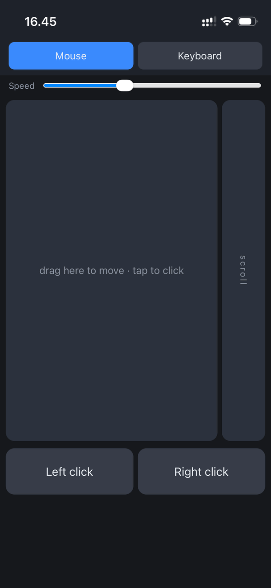
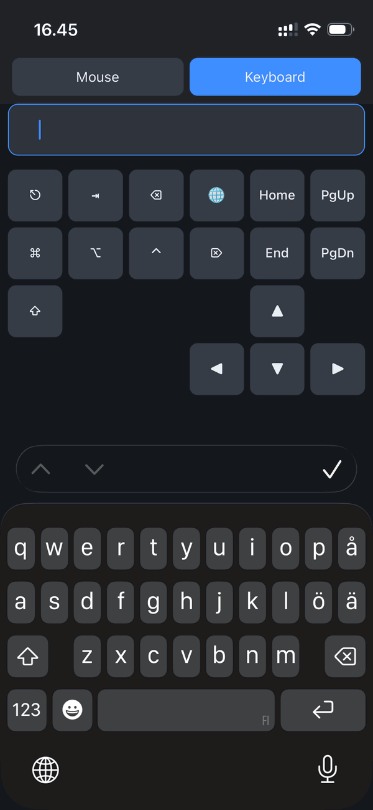

# diy-mac-remote — your iPhone as a **keyboard** and **trackpad** for your Mac, built and delivered by you.

<div align="center">
  <table>
    <tr>
      <td align="center"></td>
      <td align="center"></td>
    </tr>
    <tr>
      <td align="center"><b>The trackpad</b></td>
      <td align="center"><b>The keyboard</b></td>
    </tr>
  </table>
</div>

When you open your machine up to be controlled remotely, you **really** want
to know that the tools doing the controlling **can be trusted**.

The simplest way to raise that trust is to shrink the list of parties you have
to rely on, because even if those parties are honest, you are also trusting
that **they themselves are not hacked!**

That is the aim of this project: to keep the list of trusted parties list as
short as possible by helping you do most of it **yourself**, in a way that is
**transparent**, **verifiable**, and **easy**.

There is **no App Store app** to install. There is **no compiled installer**
for the part running on your mac. There never will be. Instead you get the
source for both halves and _you_ decide how to deliver them onto your own mac
and phone by following our guides.

`diy-mac-remote` is a kit, not a product. Nothing is signed by us, hosted by
us, or phoning home to us, because there is no "us" in the loop once you've
downloaded the repo. You are in charge of everything that runs both on your
phone and mac.

And as a small bonus, there is also no cost, and no ads.

```
┌────────────┐        you wire this up yourself:       ┌────────────┐
│  your Mac  │  ◀─ Mac software (server.js) --------   │ your iPhone│
│ (the host) │  ----- Web app (public/index.html) ─▶   │ (the app)  │
└────────────┘                                         └────────────┘
```

As an extra measure, if you have access to an LLM agent, you should download
this code, and then ask the agent to verify none of the code and examples in
this repo contain clever ways to try to hack you.

It is not only you being rightfully untrusting of me who wrote this message,
but untrusting of all of the infrastructure that was needed to send these bits
to your computer - because a lot could have gone wrong along the way, and you
might be reading a guide that was purposefully altered to get you to do things
that expose your computer to be controlled by hackers.

## The DIY deal

Two halves, and **you** are responsible for getting each one where it needs to go:

- **The backend** is `server.js` — plain JavaScript. We help you get a safe version of Node.js to run it on, and there are no other dependencies.
- **The app** is `public/index.html` — a single self-contained web page. You load it onto your phone yourself.

For each half there are several ways to do the delivery, with different
trade-offs in trust, convenience, and reach. We'll provide a menu of those
options and a guide for each. **Right now one path is written up below** — the
fast, local one, but one that requires a lot of trust from your network! More guides are coming; the philosophy is that you pick the
delivery that fits _your_ threat model and _your_ network, and we just hand you
the recipes.

## Requirements

- macOS
- iPhone
- Node.js — [`ensure-node.sh`](ensure-node.sh) takes care of this: it links a
  Node you already have, or fetches an official build and verifies it against a
  checksum pinned in this repo (see [Get a Node.js](#get-a-nodejs)).
- This repository.
- **Accessibility permission:** the first time it sends a key, macOS will ask to allow your Terminal _System Settings → Privacy & Security → Accessibility_. Grant it.
- A secured network connection between your devices:

> ⚠️ **Secure your network:** Run this either with a self-signed HTTPS certificate
> installed manyally on your iPhone manually (see [Serve it over HTTPS](#serve-it-over-https)), or over a trusted VPN like
> [Tailscale](https://tailscale.com) on both your Mac and iPhone.
> You CAN also run the server in plain HTTP mode, and the server should do a
> decent job at securing the actual control traffic, but this does open you up
> to an active MITM attack if your router is compromised;
> and since almost nobody can actually verify their router is not compromised,
> you should never do this. See [Security](#security) for threat model details.

## Delivery guide: run it locally (the default DIY path)

The simplest delivery method: run the server from source and load the app over
your LAN. No build step, no signing, no store.

The fastest path is [`start.sh`](start.sh), which makes sure there's a Node.js
to run on (`ensure-node.sh`, a no-op when there already is) and starts the
server for you:

```sh
./start.sh                # ensures ./node, then runs the server
./start.sh tailscale      # any arguments are forwarded to server.js
```

Then scan the QR code, grant Accessibility rights, and you're controlling your
Mac. The rest of this section explains each step if you'd rather run them by hand:

1. Open your Terminal.
2. Clone this repo with git on your machine.
3. Get Node.js — run [`ensure-node.sh`](ensure-node.sh) (see below).
4. Run the server with Node.js (see below).
5. Scan the QR code with your iPhone.
6. Grant Accessibility rights for Terminal.
7. Use the web app to control your Mac.
8. (optional) Add it to your Home Screen as a full-screen app.

### Get a Node.js

The bundled script makes sure `./node/bin/node` is a working Node.js, and is
**idempotent** — run it as often as you like:

```sh
./ensure-node.sh              # no-op if ./node/bin/node already works;
                              # else links your Node, or downloads + verifies one
./ensure-node.sh --download   # insist on the pinned, checksum-verified build
./node/bin/node --version     # v26.3.1 if downloaded; your own version if linked
```

If you already have Node.js (v18 or newer), it just symlinks it to
`./node/bin/node` so everything downstream uses one fixed path. Otherwise — or
with `--download`, if you'd rather not trust the copy on your machine — it
fetches an official build and checks it against a SHA-256 checksum **pinned in
this repository**, refusing to unpack anything on a mismatch. That's stronger
than trusting the checksum Node.js publishes alongside the download: if an
attacker controlled nodejs.org they could serve a malicious tarball _and_ a
matching checksum. By pinning the hash in this repo, fooling you requires
compromising **both** nodejs.org **and** this repository — the same "split your
trust" idea the rest of `diy-mac-remote` is built on.

> The download detects your Mac's CPU with `uname -m` and fetches the matching
> build — Apple Silicon (arm64) or Intel (x64). Once `./node` exists, use
> `./node/bin/node server.js` in place of `node server.js` below.

### Run the server

```sh
node server.js               # detect (default): try tailscale first, then wifi
node server.js wifi          # try only the Mac .local mDNS address
node server.js tailscale     # try only the Tailscale MagicDNS name
PORT=8700 node server.js http://192.168.0.2:8700 # custom URL verbatim
node server.js --reset-token # rotate the auth token + print a fresh pairing QR
```

It prints the address to open on your phone plus a QR code to make it easier.

**Tailscale mode restricts access to the tailnet.** Whenever the server
advertises a Tailscale address — either `tailscale` mode, or the default `detect`
mode when a tailnet is up — it accepts requests **only** from tailnet source
addresses (`100.64.0.0/10` or Tailscale's IPv6 range). The port still listens on
all interfaces, but a request from anywhere else — e.g. a co-present untrusted
Wi-Fi — is refused with a `403` _before_ it reaches any routing, crypto, or input
handling, so an on-path attacker on that LAN can't drive your Mac or get the page
to rewrite. (Filtering the source rather than binding one interface avoids a
startup race with Tailscale and survives your tailnet IP changing. The
`wifi`/`.local` and raw-IP modes don't filter. Set `HOST=<addr>` to
bind a single interface and opt out of the filter.) Explicit `tailscale` mode is
strict about it: if no tailnet is up when the server starts, it **refuses to
start** rather than silently falling back to an unfiltered LAN address (the
default `detect` mode does fall back — that's the difference between them).

[`install-tailscale.sh`](install-tailscale.sh) sets this path up: it makes sure
there's a Node.js to run on and puts a double-clickable `start.command` into
the `diy-mac-remote` folder on the Desktop — no certificate involved. The
generated `start.command` has `tailscale` mode baked in, so a double-click can
never accidentally start the server in a less strict mode.

The QR (and printed link) point at that URL with a single **pairing key** appended
as the `#fragment` (`#<key>`). The phone derives _two_ credentials from it — the
secret that keys the crypto and a token the server only ever stores hashed (see
[Security](#security)). The key is minted on first run. On a normal restart the
server can no longer show it (it kept only the derived secret and the token's hash
— that's the point), so already-paired devices just reopen the app; to pair a
**new** device, or to recover if a phone loses its pairing, run
`node server.js --reset-token` to mint a fresh key and QR (or double-click
`reset-app-secrets.command` in the Desktop `diy-mac-remote` folder and restart
the server — same effect). That rotates the pairing, so every previously
paired device must re-pair.

### Deliver the app to your Home Screen (full-screen)

`diy-mac-remote` ships an app icon and web manifest, so you can add the page to
your Home Screen and launch it full-screen with no Safari chrome — your own
hand-installed "app", no store required:

1. Open the printed `http://<mac-ip>:8765` in **Safari** on the iPhone (must be
   Safari — Chrome/Firefox on iOS can't add to the Home Screen).
2. Tap the **Share** button → **Add to Home Screen** → **Add**.
3. Launch it from the new "Mac Remote" icon. It opens full-screen.

Notes:

- Keep the Mac and phone on the same Wi-Fi or Tailscale VPN, and keep `server.js`
  running in the Terminal.

> **More delivery options coming.** This local path is one recipe. The roadmap is
> a menu of others — Tailscale-only access, port-forwarding, and so on — each with
> its own guide, so you can choose the delivery that matches the trust you have in
> your network.

## Serve it over HTTPS

By default `diy-mac-remote` runs over plain HTTP, and that is deliberately safe
against a _passive_ eavesdropper: every keystroke is already encrypted and
authenticated (ChaCha20 + HMAC) before it leaves the phone. What plain HTTP does
**not** protect against is an _active_ man-in-the-middle on a router you don't
control — someone positioned to rewrite the web page itself before your phone
ever loads it (see [Security](#security)). Serving the page over HTTPS closes
that last gap: the phone refuses any page that isn't served under a certificate
it trusts. As a bonus, an HTTPS page is a browser **"secure context"**, so the
native `crypto.subtle` becomes available and the page uses it for faster hashing
instead of the bundled pure-JS fallback.

HTTPS here means a **self-signed certificate**, using only tools already on
macOS (`openssl`). No download, no accounts, fully offline — nothing to trust
but yourself. You set up a tiny private Certificate Authority (CA) that lives
only on your Mac, install it on your iPhone **once**, and from then on your
phone trusts the server.

The CA is **name-constrained**: baked into the certificate you install is the
list of names it may ever vouch for — by default exactly one, this Mac's
`.local` name — and iOS enforces that list. Installing a homemade CA normally
means trusting it for the _whole web_; this one can never speak for
`gmail.com`, only for your Mac. (See "What you're trusting" below.)

### 1. Run the setup (on the Mac)

In Terminal, run [`install-self-signed.sh`](install-self-signed.sh) — it also
sets up Node.js in the background (see [Get a Node.js](#get-a-nodejs)) — or do
the certificate part on its own:

```sh
./install-self-signed.sh               # the whole setup, Node.js included
./setup-https.sh                       # just the certificate + Desktop folder
./setup-https.sh mymac.local 10.0.0.9  # ...plus any extra name/IP the phone will use
```

(The installers are plain shell scripts on purpose: macOS refuses to run a
_downloaded_ `.command` file from Finder. The `start.command` this run
generates on your Desktop is created locally on your Mac, so double-clicking
that is fine.)

By default the certificate covers **only the Mac's `.local` address** — no
localhost, no LAN IPs, no Tailscale names — because that's the one stable
address your phone uses on the Wi-Fi, and a narrow certificate keeps the CA's
reach narrow too. A certificate is only valid for the names baked into it, so
if your phone will reach the Mac by some _other_ address, pass it as an
argument (this is [`gen-cert.sh`](gen-cert.sh) doing the work; arguments are
forwarded to it).

This writes four files into `~/.diy-mac-remote/` (owner-only, the same place
the pairing secret lives):

- `ca-cert.pem` — your CA. **This is the file you put on the iPhone.** It's public; it's safe to copy around.
- `ca-key.pem` — the CA's private key. Stays on the Mac, owner-only. Whoever holds this can mint certs your phone will trust, so don't copy it off the machine.
- `cert.pem` / `key.pem` — the server's certificate and private key, served automatically.

It then refreshes a `diy-mac-remote` folder on your Desktop (via
[`ensure-desktop-folder.sh`](ensure-desktop-folder.sh)) and opens it in Finder.
The folder holds everything the human side of the setup needs:

- `diy-mac-remote-ca.pem` — the CA, ready to AirDrop to the phone (only ever
  the public certificate — never a private key);
- `HOWTO-AIRDROP-CERT-TO-PHONE.html` — step-by-step install instructions,
  listing the exact names the current certificate is valid for;
- `start.command` — double-click to start the server (it points at `start.sh`
  wherever this repo lives);
- `reset-app-secrets.command` / `reset-certificate.command` — double-click to
  reset the pairing or to mint a fresh CA + certificate. Both are thin entries
  into [`reset.sh`](reset.sh): they ask for confirmation first, and the reset
  takes effect when the server is next started.

### 2. Install and trust the CA on the iPhone (once)

You need to get the CA onto the phone and then flip **two** switches —
installing a certificate and _trusting_ it are separate steps on iOS. The
`HOWTO-AIRDROP-CERT-TO-PHONE.html` in the Desktop folder walks you through
exactly this:

1. **Get the file onto the phone.** In the Desktop folder, right-click
   `diy-mac-remote-ca.pem` → **Share → AirDrop** → your iPhone. (If AirDrop
   doesn't offer to install it, email the file to yourself and open it in the
   Mail app instead. Some iOS versions are fussy about the extension — if so,
   rename the copy to `diy-mac-remote-ca.crt` and send that.)
2. iOS says **"Profile Downloaded"**. Open **Settings** → it shows **Profile
   Downloaded** near the top (or go to **Settings → General → VPN & Device
   Management**).
3. Tap the **diy-mac-remote local CA** profile → **Install** (enter your
   passcode) → **Install** again to confirm.
4. **Now trust it** — this is the step people miss. Go to **Settings → General →
   About → Certificate Trust Settings**. Under **Enable Full Trust for Root
   Certificates**, turn **ON** the switch for **diy-mac-remote local CA**.

### 3. Start the server

Double-click `start.command` in the Desktop `diy-mac-remote` folder, or run
`./start.sh`. Nothing new to type — the server serves HTTPS automatically as
soon as the certificate files exist, and the printed QR/link switches to
`https://`:

```sh
./start.sh
```

Scan the QR in **Safari** — no warning, a padlock — pair, and Add to Home
Screen. To temporarily go back to plain HTTP, start with `--no-tls`. To
_require_ HTTPS (fail loudly if the cert is missing rather than silently
falling back), use `--tls`.

### Notes and caveats

- **Re-running is always safe.** `./setup-https.sh` (or
  `./install-self-signed.sh`) mints a fresh server certificate and
  refreshes the Desktop folder, but reuses
  the CA — so the phone keeps trusting the new certificate with **no
  reinstall**. Re-run it after renaming the Mac, or to add an extra name.
- **The certificate names only the `.local` address**, so reach the Mac by that
  name. IP churn doesn't matter (there are no IPs in the certificate), and the
  `.local` name is stable. If you _must_ use another address — a raw IP, a
  Tailscale MagicDNS name — pass it to `./setup-https.sh` explicitly; the
  server warns at startup if it's about to advertise an address the certificate
  doesn't cover. Note that a genuinely new name (a renamed Mac) falls outside
  the existing CA's name constraints; the script detects that, refuses to mint
  a certificate the phone would reject, and prints the two commands to mint a
  fresh CA (one profile re-install).
- **HTTPS + Tailscale mode:** the default certificate doesn't cover the MagicDNS
  name, so when serving HTTPS the default `detect` mode advertises the `.local`
  name even when a tailnet is up. Explicit `./start.sh tailscale` still works —
  add the MagicDNS name to the certificate first
  (`./setup-https.sh <mac>.<tailnet>.ts.net`).
- **Untrusting it later:** delete the profile on the phone under **Settings →
  General → VPN & Device Management**, or turn its switch back off under
  **Certificate Trust Settings**.
- **What you're trusting:** the CA private key never leaves your Mac and is
  owner-only. Anyone who both steals `ca-key.pem` _and_ can position themselves as
  a man-in-the-middle on your network could forge a page your phone accepts — so
  treat `ca-key.pem` like the pairing secret. For the home-LAN threat model this
  is exactly the transport trust that plain HTTP was missing. Thanks to the name
  constraints, that is also the _worst_ case: a stolen CA key can impersonate
  this Mac's addresses to your phone, never the rest of the web — so trusting
  this CA does not put your general browsing in one file's hands.
- This does not replace any of the app-layer crypto; it's defence-in-depth on top
  of it.

## The keyboard

The Keyboard tab pairs your phone's **own native keyboard** with a bar of the
special keys a phone keyboard lacks.

- **Type with the native keyboard.** Tap the capture field and your phone's
  keyboard pops up below; whatever you type — letters, numbers, symbols, **å ä ö**,
  emoji, swipe-typed words, predictive suggestions — is sent straight to the Mac.
  This means your own layout, languages, and autocomplete, instead of a fixed
  on-screen grid. (Soft keyboards don't emit reliable key events, so the app reads
  the field's edit events instead and forwards each one as a keystroke.)
- **A special-keys bar sits above it**: ⎋ esc, ⇥ tab, the modifiers (⌘ ⌥ ⌃ ⇧),
  and a navigation row (⌫ backspace, ⌦ forward-delete, ← ↑ ↓ →, ⏎ return). These
  stay visible above the native keyboard and don't dismiss it when tapped.
- **Modifier** keys (⌘ ⌥ ⌃ ⇧) **latch**: tap one and it stays held (highlighted
  gold) until you tap it again. While held they combine with what you type next on
  the native keyboard, so you can build combos and selections:
  - tap **⌘**, then press **S** → Cmd-S (⌘ stays held — tap it again to release).
  - hold **⇧** then tap **→** repeatedly to extend a selection.
  - hold **⌘** and **⇧** together, then press **T** → Cmd-Shift-T.
- Backspace, return, and the native "delete word" gesture are all forwarded; the
  native keyboard's own shift/caps handles letter case.

## The trackpad

The app opens on the **Mouse** tab. It's a remote trackpad:

- **Drag** anywhere on the trackpad area to move the cursor (relative movement,
  like a laptop trackpad); **tap** it for a left click.
- A **scroll** strip down the side scrolls the wheel.
- **Left click** / **Right click** buttons below the pad. They are
  **press-and-hold**: the button stays down while you hold it, so you can hold a
  button and drag on the trackpad with another finger to drag-and-drop, then
  release to drop.
- A **sensitivity** slider at the top scales pointer speed (0.5–6×, default 2.5).

Moves and scrolls are coalesced client-side and sent on the same ~50 ms grid as
keystrokes, so a drag becomes a few summed deltas rather than a flood of
messages.

## How it works

Everything runs through macOS's `osascript`, in two different language modes.

**Keypresses** use AppleScript (the default mode):

```sh
osascript -e 'tell application "System Events" to key code 36'   # Enter
```

The server turns each keypress op into an AppleScript `keystroke` / `key code`
program (all of the op's actions in one `tell application` block) and runs
`osascript` once per op.

**Mouse** events use JXA — JavaScript for Automation — via `osascript -l
JavaScript`, because AppleScript has no clean way to move the cursor while JXA
can call CoreGraphics (Quartz Event Services: `CGEventCreateMouseEvent` etc.).
Spawning a JXA process per movement would be far too slow (~100 ms startup), so
the server keeps **one long-lived `osascript` helper** and streams
newline-delimited JSON commands to its stdin — fast enough to feel like a real
trackpad. (See `mouse.js`.)

## HTTP API

- `GET /` — the keyboard web app. (public)
- `GET /nonce` — issue a fresh nonce `{ nonce, ttlMs }`. (public)
- `POST /msg` — the single **authenticated + encrypted** action endpoint. Body is
  an envelope `{ iv, ct, mac }` (see below).

There is one action endpoint; the operation (keypress vs. mouse) lives in the
_encrypted_ payload, so the URL never reveals what you sent.

### The `/msg` envelope

```
iv  = base64(random 12-byte ChaCha20 nonce)
ct  = base64(ChaCha20(encKey, iv, counter=1, pad(plaintext)))
mac = hex(HMAC_SHA256(macKey, "POST\n/msg\n" + iv + "\n" + ct))   // encrypt-then-MAC

plaintext = JSON: { "n": <authNonce>, "c": <counter>, "o": [ <op>, ... ], "p": <token> }
op        = { "t":"k", "b": <action obj/array> }   // a keypress
          | { "t":"m", "k":"mv", "dx":<n>, "dy":<n> }   // mouse move (relative)
          | { "t":"m", "k":"cl", "btn":"l"|"r" }        // mouse click (down+up)
          | { "t":"m", "k":"dn", "btn":"l"|"r" }        // mouse button down (hold)
          | { "t":"m", "k":"up", "btn":"l"|"r" }        // mouse button up (release)
          | { "t":"m", "k":"sc", "dy":<n> }             // scroll wheel

pad(x)  = x + spaces, to a multiple of 256 bytes (JSON.parse ignores the spaces)
encKey  = SHA256("diy-mac-remote-enc:" + secret)
macKey  = SHA256("diy-mac-remote-mac:" + secret)
```

`o` is an **array** of ops: the client coalesces keystrokes pressed within a short
window into one message (see padding/batching below). The server verifies the MAC
over the ciphertext, decrypts, checks the nonce and counter, then runs the ops in
order.

## Security

`diy-mac-remote` gives you **authentication, replay protection, and
confidentiality** — everything except transport-level trust for your mobile app
interface.

So a simple eavesdropper in LAN can **NOT** read keystrokes or replay controls,
but if you have a compromised router in your LAN, and an Active Middle Man
attacker in your network when your phone loads the UI from the server, the
attacker can start operating your keyboard and mouse. You do not want that.

1. **Shared secret.** Stored in `~/.diy-mac-remote/secret` (auto-created, 32 hex
   chars, owner-only perms), kept in memory while running. Ownership and mode are
   **re-checked on every load** (ssh-style): the server refuses to use the secret
   if the file or its directory is owned by another user or is readable by group/
   other, rather than trusting whatever is on disk — so a stray process can't slip
   in a secret it knows, and a loosened-perms secret is rejected instead of used.
   The secret is **derived** from the pairing key the phone gets
   **out-of-band via the QR code** the server prints on startup, which encodes
   `http://host.local:PORT/#<key>` — a single high-entropy value. The `#fragment`
   is **never sent to the server**, so the pairing key stays off the wire; the page
   reads it from `location.hash`, derives the secret (and the token, item 5), and
   stores those in `localStorage`. (You can also paste the key — the app prompts if
   it has none.) Two subkeys are then derived from the secret (one for the cipher,
   one for the MAC).
2. **Confidentiality.** Every action is encrypted with **ChaCha20** before
   sending. A fresh random nonce per message means identical keystrokes never
   produce identical ciphertext, so an eavesdropper can't correlate or count
   repeats. The auth nonce + counter are _inside_ the ciphertext too.
   - **Length hiding:** plaintext is padded with spaces to a multiple of 256
     bytes before encryption, so a single letter, a modifier combo, and a mouse
     move all look the same size on the wire (a stream cipher otherwise leaks length).
   - **Timing hiding (light):** sends are quantized to a ~50 ms grid and
     keystrokes in the same window are batched into one message, blurring precise
     inter-keystroke timing. (Full timing privacy would need constant-rate cover
     traffic; this is a deliberate light touch.)
3. **Authentication.** **Encrypt-then-MAC** with HMAC-SHA256 over the ciphertext;
   the server verifies the MAC _before_ decrypting. The secret itself is never
   transmitted.
4. **Replay protection.** The server tracks the highest counter seen per nonce
   and rejects anything not strictly greater. Nonces are random 256-bit values,
   in-memory only (a restart invalidates old sessions), expire after 1 hour, and
   are capped to bound memory.
5. **Second-layer auth token (disk-read hardening).** The shared secret has to
   sit on disk in the clear — the server needs it to run the crypto — so anyone
   who can **read** the disk (or restores a backup of your home dir) gets the
   secret and could forge the crypto layer. A second-layer **token** guards against
   exactly that. First run mints one random **pairing key** (the `#<key>` in the
   QR) and derives from it, with two domain-separated one-way hashes, both the
   `secret` and the `token`. On disk it stores the `secret` and **only the SHA-256
   hash** of the token (`~/.diy-mac-remote/token.hash`, owner-only, perms enforced
   on load); the **pairing key itself is never written to disk** — persisting it
   would let a reader re-derive the token and defeat the layer. The phone keeps the
   pairing key, re-derives the token, and includes it (`"p"`) inside every encrypted
   message; the server hashes what it receives and compares — in constant time —
   against the stored hash. So a disk reader gets `secret` + `hash(token)`, **not**
   the token (and can't get it from the secret: `secret = H₁(key)` reveals nothing
   about `token = H₂(key)`, and the 128-bit key can't be brute-forced), so the
   server rejects every command. Deriving both from one key is purely so the QR
   stays small; it doesn't weaken the split. Because the server keeps only the
   secret + token hash, it can't reprint the pairing key on a later start: paired
   devices just reopen the app, and to pair a new device (or recover a lost pairing)
   you run `node server.js --reset-token`, which mints a fresh key + QR (all devices
   re-pair; note the secret rotates with it).
   - **What this covers:** offline theft of the disk or a backup — someone who
     ends up with your files but was never on your network still can't drive the
     Mac.
   - **What it does _not_ cover:** an attacker who **also captured your live
     traffic** (the secret decrypts the token straight off the wire), or who can
     **read process memory** (both live there while running), or who can **write**
     the hash file (they'd just overwrite it — but such an attacker could overwrite
     the secret too). This is a hardening of the read-only-disk case, not a new
     trust boundary against an on-network attacker. For that, still use TLS/VPN.

**Backups.** Owner-only file permissions mean nothing on a mounted backup:
whoever restores a copy of your home directory reads `secret`, `token.hash`,
and (if you use HTTPS) `key.pem` + `ca-key.pem` — enough to impersonate the
server to your phone. So the server and `gen-cert.sh` both mark
`~/.diy-mac-remote/` as **excluded from Time Machine** (`tmutil addexclusion`,
the sticky no-sudo form) whenever they touch it. Caveats, honestly stated:

- **Time Machine only.** Third-party backup tools (Backblaze, Arq, rsync
  scripts, disk clones) generally ignore the exclusion attribute — check your
  own tool, or exclude the directory there too.
- **Tailscale keeps its own keys** (its node key) in its own app data, which
  _is_ backed up. Those are Tailscale's to manage — but unlike your CA key, a
  stolen node key can be revoked from the admin console.
- **Excluded means not restored.** After restoring a Mac from backup the server
  simply mints a fresh pairing on first run (scan the new QR to re-pair), and
  HTTPS users re-run `./setup-https.sh` and install the new CA once. That's the
  point: a restore is exactly the moment you want fresh keys, not old ones with
  an unknown number of copies.

**Crypto in the browser:** `crypto.subtle` (Web Crypto) is only available in a
secure context (HTTPS/localhost), which plain-HTTP LAN pages are not. So the page
ships small, test-vector-verified **pure-JS SHA-256 and ChaCha20** (inlined in
`index.html`), using native Web Crypto for hashing when it _is_ available.

**Remaining caveat:** by default this is application-layer crypto over plain
HTTP, not TLS. It protects the _contents_ of requests, but without a trusted
server certificate it can't stop an active man-in-the-middle who can rewrite the
page itself. For a trusted home LAN that's fine; to close the gap, serve it over
HTTPS — a self-signed cert you install on your phone once — see
[Serve it over HTTPS](#serve-it-over-https).

## Files

- `start.sh` — one-command launcher: runs `ensure-node.sh`, then starts the
  server with `./node/bin/node` (forwarding any arguments to `server.js`).
- `ensure-node.sh` — idempotently makes sure `./node/bin/node` works: a no-op
  if it already does, else it symlinks a pre-installed Node (v18+), else it
  fetches an official build and verifies it against a SHA-256 checksum pinned
  in this repo before unpacking it into `./node` (`--download` forces this).
- `setup-https.sh` — one-command HTTPS setup: generates the certificate
  (`gen-cert.sh`) and refreshes the Desktop folder (`ensure-desktop-folder.sh`);
  see [Serve it over HTTPS](#serve-it-over-https).
- `install-self-signed.sh` — one-command install for the self-signed HTTPS
  path: runs `setup-https.sh` with `ensure-node.sh` in the background.
- `install-tailscale.sh` — installer for the Tailscale path: runs
  `ensure-node.sh` and drops just a `start.command` (with `tailscale` mode
  baked in) into the Desktop folder — no certificate, nothing to install on the
  phone.
- `gen-cert.sh` — the certificate workhorse: makes a self-signed TLS certificate
  with `openssl` (already on macOS) for this Mac's `.local` name (plus any
  names/IPs you pass).
- `ensure-desktop-folder.sh` — makes sure the `diy-mac-remote` folder on the
  Desktop is up to date: the CA ready to AirDrop, an HTML how-to matching the
  current certificate, and double-clickable `start.command` /
  `reset-app-secrets.command` / `reset-certificate.command` entries pointing
  at this repo.
- `reset.sh` — the reset logic behind those entries: `./reset.sh app-secrets`
  forgets the pairing (fresh QR on next start, all devices re-pair);
  `./reset.sh certificate` mints a fresh CA + certificate (install the new CA
  on the phone once). Both confirm before resetting; a running server picks
  the reset up on its next start.
- `server.js` — HTTP/HTTPS server, routing, auth/crypto, static files.
- `executor.js` — turns key actions into AppleScript and runs `osascript`.
- `mouse.js` — long-lived JXA (`osascript -l JavaScript`) helper that posts
  CoreGraphics mouse-move / click / scroll events.
- `keys.js` — key-code and modifier maps.
- `chacha20.js` — pure-JS ChaCha20 (server side; an identical copy is inlined in
  the page so both ends interoperate).
- `public/index.html` — the mobile web keyboard (self-contained; inlines SHA-256,
  ChaCha20, HMAC, and the UI).
- `public/manifest.webmanifest`, `public/icon-*.png` — Home-Screen app metadata.
- `qr.js` — self-contained QR-code generator used to print the scan-to-connect
  QR on startup. Fixed to Version 5 / EC level L / byte mode (106 bytes max).
- `test/` — the test suite (see below). Zero dependencies, no framework.

## Tests

Run them with plain Node — there's nothing to install:

```sh
npm test          # or: node test/run.js
```

Like the rest of the project, the suite has **no dependencies and no framework** —
just a ~20-line runner (`test/harness.js`) over `node:assert`, so it's as
auditable as the code it checks. It covers the security-critical parts:

- **`chacha20.test.js`** — checks the pure-JS cipher against Node's _native_
  ChaCha20 (authoritative, can't be miscopied), the RFC 8439 keystream vector, and
  the encrypt/decrypt round-trip.
- **`parity.test.js`** — runs the page's _inlined_ SHA-256, ChaCha20, and
  credential derivation in a sandbox and asserts they agree byte-for-byte with the
  server, so the two copies can't silently drift apart.
- **`pairing.test.js`** — drives the real server over HTTP the way the phone does:
  master-derivation, the token second layer (valid → 200, wrong/missing → 401),
  the **"the master is never written to disk"** invariant, owner-only file perms,
  restart behaviour, and `--reset-token` rotation.

## License

`diy-mac-remote` is released under the [MIT License](LICENSE).

This project has no third-party runtime dependencies.
